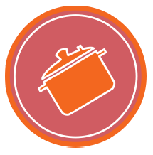

# Marmite-974
 
# Projet Final

#### Coder et déployer une application web simple

## Introduction

Nous sommes un centre de formation de cuisine qui propose des ateliers à nos élèves à
partir de 12 ans, mais aussi à des particuliers.
Les cours proposés aux particuliers permettent de financer l’achat de matériels et de
matières premières.
C’est la raison pour laquelle nous souhaitons booster cette activité en grâce à une
application web.

## Objectif

Nous voulons une application web qui permette à des particuliers de s’inscrire aux ateliers
que nous proposons.
Nous voulons tester la viabilité de l’application, c’est pourquoi nous voulons une application
simple dans un premier temps.
Il est à noter qu’il n’est pas nécessaire de se soucier du paiement, car cela se fera sur place
avant le début des ateliers.

## Cibles

Nos cibles sont les jeunes actifs entre 25 - 35 ans. Des personnes qui veulent apprendre à
cuisiner afin de manger correctement.

## Utilisateurs

Nous avons identifié 2 types d’utilisateurs.

#### Cuisinier

Le cuisinier créé les ateliers et les propose aux particuliers.
Il est défini par son nom, prénom, email et spécialité.
Tous les champs sont obligatoires sauf spécialité.

#### Particulier

Le particulier s’inscrit à un atelier en entrant son nom, prénom, numéro de téléphone et
email.
Il est défini par les champs nom, prénom, téléphone et emails. Tous les champs sont
obligatoires sauf téléphone.
**Remarque**
Il ne peut avoir 2 utilisateurs avec le même email.

## Les ateliers

Chaque atelier possède les champs suivants :

- un titre
- une description du contenu de l’atelier
- une date
- l’horaire de début
- la durée
- le nombre de places disponible
- le nombre de places réservées
- le prix
- une image
Ces champs sont tous obligatoires.

## Les fonctionnalités
## User Stories 

| En tant que    | je veux                      | afin de                                           | Critère                                         |                  
| :--------------| :----------------------------| :-------------------------------------------------| :------------------------------------------------------------|
|   CUISINIER    | désactiver/activer           | Rendre visible ou invisible pour les particuliers |- Désactiver l'atelier ne rend plus visible sur la liste des ateliers  - Activer l’atelier le rend visible sur la liste des ateliers |
|   CUISINIER    |modifier un atelier           |changer les informations rentrées précédemment     |Les modifications apparaissent dans la liste des ateliers      |
|   CUISINIER    | créer un atelier             |proposer à des particuliers                        |L’atelier nouvellement créé apparaît dans la liste des ateliers|
|   CUISINIER    |avoir une interface d’administration sécurisé|être le seul à pouvoir modifier mes ateliers|Le cuisinier accède aux pages sécurisées grâce à un login et mot de passe. Le cuisinier ne voit que les ateliers qu’il a créé|
|  PARTICULIER   |voir la liste des ateliers    |s’inscrire à un atelier                            |une page qui affiche la liste des ateliers disponibles         |
|  PARTICULIER   |m’inscrire à un atelier       |de réserver ma place     |quand un particulier s’inscrit à l’atelier le nombre de places réservées de celui augmente|

## Charte graphique

### Notre logo

### Couleurs

Les couleurs de notre charte graphique sont :

**#d05c62**

**#f3671f**

### Les polices

Les titres doivent utiliser la police Roboto.
Les autres textes utilisent la police Verdana.

### Design

Nous n’avons pas de directives particulières pour la première version de l’application si ce
n’est que l’interface devra être simple et clean.

## Périmètre

L’application doit :

- fonctionner en ligne
- afficher correctement sur plusieurs navigateurs récents (Edge, Chrome, Firefox)
- respecter les normes du W3C
- être responsive

## Wireframe

